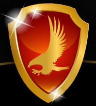

# Eagle Defense Systems, LLC



**Veteran-Owned | Cybersecurity, Compliance, & Cloud Security Solutions**

https://eagledefensesys.tech

---

## 🚀 About

Eagle Defense Systems, LLC is a veteran-owned cybersecurity consultancy and technology builder. We help government contractors, agencies, and commercial organizations achieve and maintain compliance through secure, scalable, and AI-driven solutions.

---

## 🖥️ Live Site

Visit: [eagledefensesys.tech](https://eagledefensesys.tech)

---

## 🛠️ Technology Stack

- **React + TypeScript**
- **Chakra UI** for responsive design
- **Vite** (or Create React App, specify which)
- **Basin** (for secure contact form handling)
- **Deployed:** [Your platform, e.g. Vercel, Netlify, etc.]

---

## 📦 Project Structure

- `src/`
  - `components/` — Reusable UI elements
  - `pages/` — Main site pages (About, Capabilities, Projects, Contact)
  - `assets/` — Images, logos, video backgrounds, and PDFs

---

## ✨ Features

- **Modern UI** — Built with Chakra UI for instant responsiveness and accessibility.
- **Technology Portfolio** — Showcases EDS’s core security and compliance tools.
- **Contact & Demo Forms** — Secure, spam-protected contact forms (via Basin).
- **Downloadable Capability Statement** — One-click PDF view/download.
- **Mobile-First** — Clean and functional across all device sizes.

---

## 📚 How to Run Locally

```bash
git clone https://github.com/securedbyjc/eagledefensesys.tech.git
cd eagledefensesys.tech/webapp
npm install
npm run dev     # or 'yarn start' if using yarn

📝 License
MIT License (edit as appropriate for your project).

🤝 Contact
For business or collaboration inquiries, use our Contact Page
or email: jcollins@eagledefensesys.tech

Built with pride by Eagle Defense Systems, LLC
